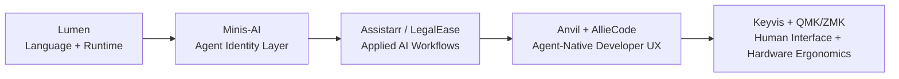

<h1 align="center">alliecatowo</h1>
<p align="center">
I build AI-native systems end-to-end: from deterministic language/runtime primitives to ambient, human-centered tools.
</p>
<p align="center">
  <a href="https://allisons.dev"></a>
  <a href="https://github.com/alliecatowo?tab=followers"></a>
  <a href="https://github.com/alliecatowo?tab=repositories"></a>
</p>

```rust
let allie = Engineer::new()
    .focus(["AI-native systems", "language/runtime design", "agentic DX"])
    .building(["lumen", "minis-ai", "assistarr", "anvil", "alliecode"])
    .location("Fresno, California");
```

> I yell at robots and occasionally program things.

## What I Actually Build

| Project | What It Is | Status |
|---------|------------|-------|
| **[lumen](https://github.com/alliecatowo/lumen)** | Markdown-native, statically typed language in Rust for deterministic agent workflows. | Active |
| **[minis-ai](https://github.com/alliecatowo/minis-ai)** | Mini teammate clones generated from developer signal for pre-review feedback loops. | Active |
| **[assistarr](https://github.com/alliecatowo/assistarr)** | Natural-language control for self-hosted media stacks (Jellyfin + *arr ecosystem). | Active |
| **[anvil](https://github.com/alliecatowo/anvil)** | Agent-native macOS development environment experiments, post-IDE direction. | Active |
| **[alliecode](https://github.com/alliecatowo/alliecode)** | Provider-agnostic AI coding CLI with a robust terminal interface. | Active |
| **[keyvis](https://github.com/alliecatowo/keyvis)** | Always-on-top keyboard layer + keypress visualization for split keyboard workflows. | Active |
| **[allie-cat-keeb-vial](https://github.com/alliecatowo/allie-cat-keeb-vial)** | QMK firmware with Vial support for Lily58 keyboard with custom userspace flows. | Maintained |
| **[legalease-ai](https://github.com/alliecatowo/legalease-ai)** | Self-hostable legal discovery and search workflows for sensitive document sets. | Maintained |

## Feature Spotlight

<p>
  <a href="https://github.com/alliecatowo/lumen">
    
  </a>
  <a href="https://github.com/alliecatowo/minis-ai">
    
  </a>
  <a href="https://github.com/alliecatowo/assistarr">
    
  </a>
  <a href="https://github.com/alliecatowo/keyvis">
    
  </a>
</p>

## Build Principles

- Deterministic systems over magical black boxes where reliability matters.
- Product feel matters as much as architecture quality.
- Agent workflows should be inspectable, composable, and fast to iterate.

## Ecosystem Flow



## Stack


## Deep Dives

- [Now](docs/now.md)
- [Projects](docs/projects.md)
- [Architecture Map](docs/architecture-map.md)
- [Changelog](docs/changelog.md)
- [Uses](docs/uses.md)

## Work With Me

- Building applied AI systems that need reliability under real constraints.
- Prototyping agent-native developer workflows and post-IDE tooling.
- Collaborating on language/runtime and human-interface experiments.

<p>
  <a href="https://allisons.dev"></a>
  <a href="https://github.com/alliecatowo"></a>
</p>

## GitHub Stats

<a href="https://github.com/alliecatowo">
  
  
</a>

<sub>Full-stack engineer · AI systems + language/runtime + ambient interfaces · she/her · <a href="https://allisons.dev">allisons.dev</a></sub>
